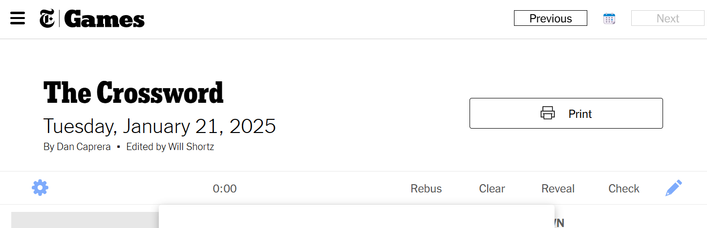

This is a Tampermonkey JavaScript file that will add Previous, 📆, and Next buttons to the NYT Crossword Puzzle webpage for easier navigation around the calendar. It mostly shouldn't send you to days that don't exist yet but hasn't been thoroughly tested. When you're at the latest puzzle, the Next button should grey out as shown in the screenshot below. 



# Installation/Usage
1. Install the Tampermonkey extension/add-on for your web browser
2. Copy the code from [tampermonkey_script.js](tampermonkey_script.js)
3. In your browser, open Tampermonkey and click the Add Script tab [+]
4. Paste the code into the script window and hit save

You should check/edit the archive bookmark section before running this script. You may also need to tweak the ```extraTimeout``` if the script isn't catching the correct place to put the buttons.

## Using the archive bookmark
I like to work on a backlog of previous puzzles, but often start with whatever the current daily puzzle is before heading to older ones. If you are like me and want to work through a backlog of previous puzzles, you can set a default archive bookmark for which month to show when you click on the new calendar icon button. This default will only override the calendar link behavior if you're on the newest puzzle.  To set it up, make sure ```useArchiveBookmark``` is set to true.  Update the ```archiveBookmarkYear``` and ```archiveBookmarkMonth``` values to your desired target year and month.
